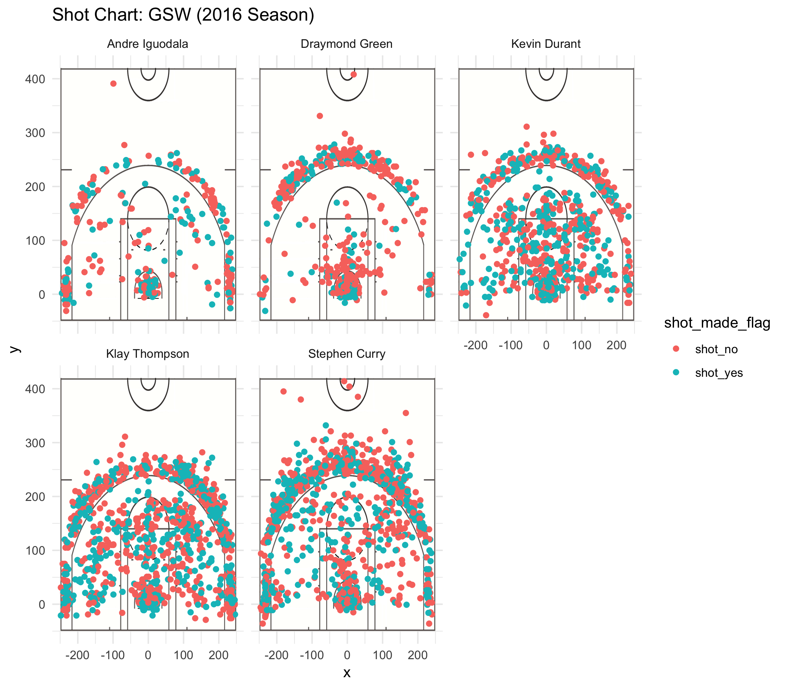
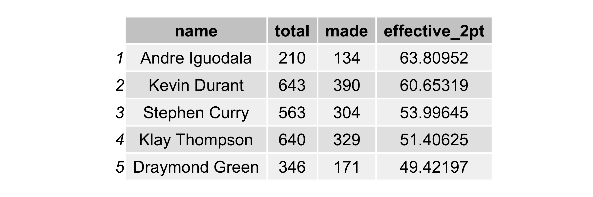
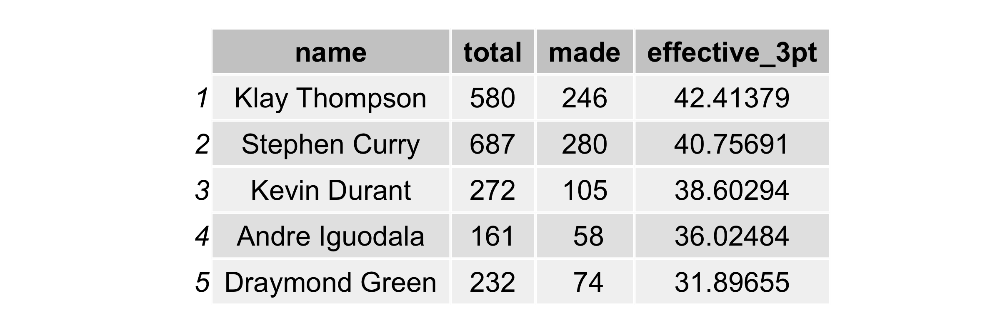
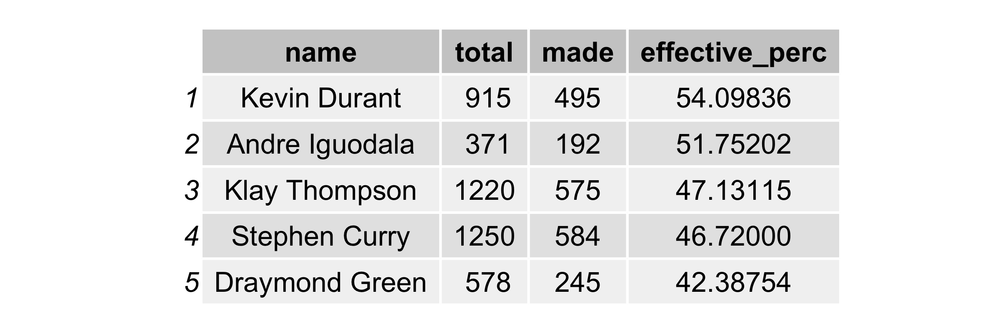

```{r setup, include= FALSE}
knitr::opts_chunk$set(echo = TRUE)
library(dplyr)
#library(grid)
library(gridExtra)
```
# A Tale of Two Splash Bros 

It isn't a surprise to most Warriors fans when they see the two splash brothers Steph Curry and Klay Thompson making it rain threes on any given night of the season. Taking a deeper look into the pairs statistics along with the rest of the starters shows why they are a seemingly unstoppable force in the NBA. 

## Motivation

The absolute dominance by the Warriors in 2015-16 made them the winningest team in NBA history beating the Bulls record that Michael Jordan set. This undoubtably made them one of the best teams to ever step foot on the court. With the addition of Kevin Durant in the upcoming season we decided to dive deeper into the stats of the Warriors and see just how their play broke down. We took a look at effective shooting percentage as a whole and for 2 point shots and 3 point shots. This data gave us an insight to what types of shots different players were taking and how effective they were when taking them. 

## Data

We had shot data for all 5 Golden State starters Stephen Curry, Draymond Green, Kevin Durant, Andre Iguodala, and Klay Thompson. We took the csv files for all 5 players and combined them into one large table with statics such as: 

* period 
* minutes remaining 
* shot made 
* shot distance
* x location
* y location
* action type

All these fields along with the others in the dataframe could help us visualize this data and interpret what it really means. 

## Analysis 

In order to analyze the data we took it and tried to interpret it in a few forms. I attempted to visualize the data in a graph form to get a map of the shots that players were taking and which shots they would make and which shots they would miss. Most people know that Steph Curry and Klay Thompson are referred to as the splash bros for the large amounts of threes that they take and make a game, but it isn't apparent the pure volume of threes that they take until you take all their shots from a season and put them on a graph. As you can see below, it is pretty rediculous: 
```{r out.width='80%', echo = FALSE, fig.align='center'}

```

In addition to graphing the shots I also went ahead and create tables to calculate effective shooting percentage:
```{r effective % table, include = FALSE}
colClass <- c("NULL", "character", "character", "integer", "integer",
             "integer","integer","factor","factor","factor",
             "integer","character","integer","integer", "character", "integer")

shots_data <- read.csv("../data/shots-data.csv", stringsAsFactors = FALSE, 
                       colClasses = colClass)
png("../images/effective_2pt.png", height=2, width=6,units="in", res = 400)
grid.table(arrange(summarise(group_by(filter(shots_data, shot_type == "2PT Field Goal"), name), total = n(), made = sum(shot_made_flag == "shot_yes"), effective_2pt = (made/total)*100), desc(effective_2pt)))
dev.off()
png("../images/effective_3pt.png", height=2, width=6,units="in", res = 400)
grid.table(arrange(summarise(group_by(filter(shots_data, shot_type == "3PT Field Goal"), name), total = n(), made = sum(shot_made_flag == "shot_yes"), effective_3pt = (made/total)*100), desc(effective_3pt)))
dev.off()

png("../images/effective_perc.png", height=2, width=6,units="in", res = 400)
grid.table(arrange(summarise(group_by(shots_data, name), total = n(), made = sum(shot_made_flag == "shot_yes"), effective_perc = (made/total)*100), desc(effective_perc)))
dev.off()
```
## 2PT Effective Shooting % by Player
```{r out.width='80%', echo = FALSE, fig.align='center'}

```

## 3PT Effective Shooting % by Player
```{r out.width='80%', echo = FALSE, fig.align='center'}

```

## Effective Shooting % by Player
```{r out.width='80%', echo = FALSE, fig.align='center'}

```

