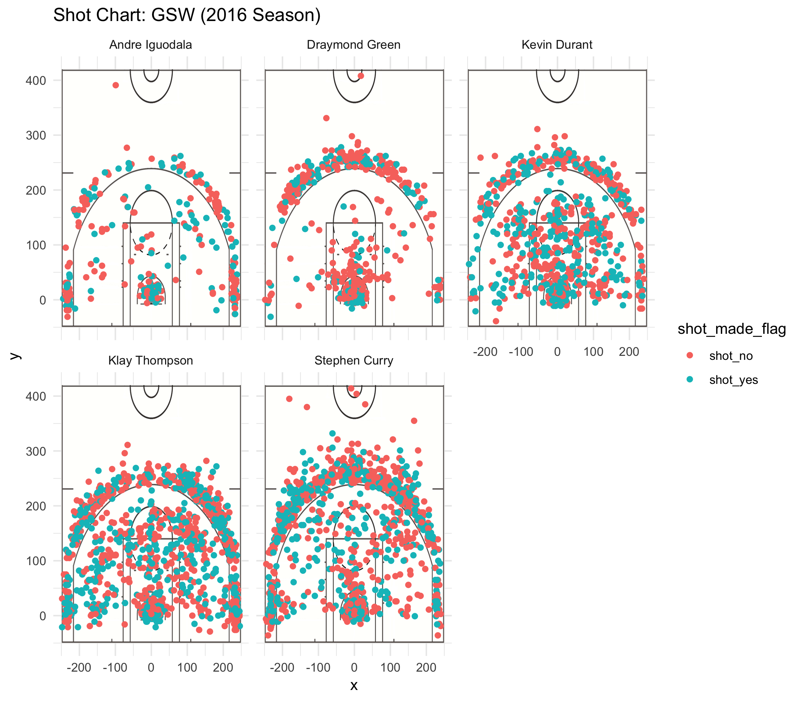
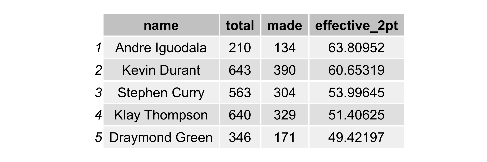
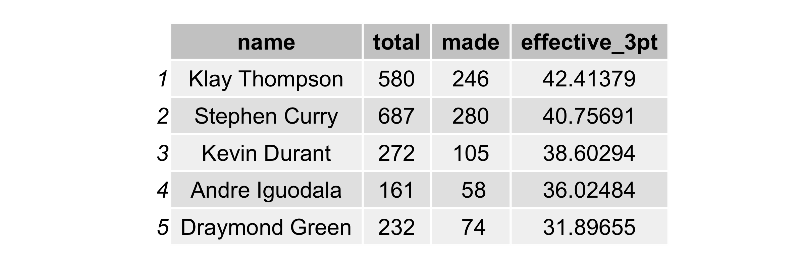
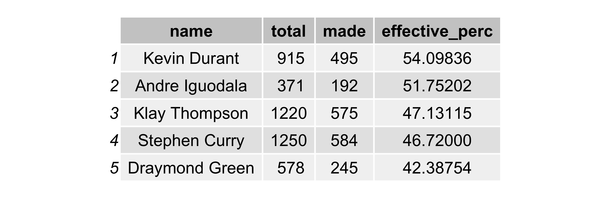
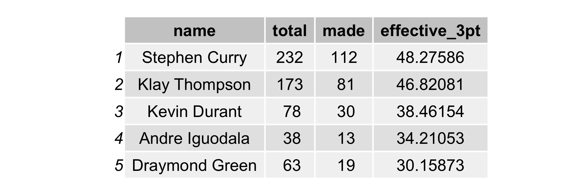

workout01-thomas-bates
================
Thomas Bates
3/11/2019

# A Tale of Two Splash Bros

It isn’t a surprise to most Warriors fans when they see the two splash
brothers Steph Curry and Klay Thompson making it rain threes on any
given night of the season. Taking a deeper look into the pairs
statistics along with the rest of the starters shows why they are a
seemingly unstoppable force in the NBA.

## Motivation

The absolute dominance by the Warriors in 2015-16 made them the
winningest team in NBA history beating the Bulls record that Michael
Jordan set. This undoubtably made them one of the best teams to ever
step foot on the court. With the addition of Kevin Durant in the
upcoming season we decided to dive deeper into the stats of the Warriors
and see just how their play broke down. We took a look at effective
shooting percentage as a whole and for 2 point shots and 3 point shots.
This data gave us an insight to what types of shots different players
were taking and how effective they were when taking them.

## Data

We had shot data for all 5 Golden State starters Stephen Curry, Draymond
Green, Kevin Durant, Andre Iguodala, and Klay Thompson. We took the csv
files for all 5 players and combined them into one large table with
statics such as:

  - period
  - minutes remaining
  - shot made
  - shot distance
  - x location
  - y location
  - action type

All these fields along with the others in the dataframe could help us
visualize this data and interpret what it really means.

## Analysis

In order to analyze the data we took it and tried to interpret it in a
few forms. I attempted to visualize the data in a graph form to get a
map of the shots that players were taking and which shots they would
make and which shots they would miss. Most people know that Steph Curry
and Klay Thompson are referred to as the splash bros for the large
amounts of threes that they take and make a game, but it isn’t apparent
the pure volume of threes that they take until you take all their shots
from a season and put them on a graph. As you can see below, it is
pretty ridiculous:

In addition to graphing the shots I also went ahead and create tables to
calculate effective shooting percentage so you could really see the
numbers that drive the team. The result shed light onto what role
players on the team play and how the Splash Bros handle things from
beyond the arc and with Daymond, Kevin Durant, and Andre Iguodala inside
the paint this gives the Warriors tons of oppertunities to get offensive
rebounds and get the ball in the hands of Steph and Klay. The numbers
for effective shooting percentage are listed
bellow:

## 2PT Effective Shooting % by Player

## 3PT Effective Shooting % by Player

## Effective Shooting % by Player

As you can see the Warriors are obviously carried by the strength of the
two splash bros and their effective 3pt shooting percentage, but what is
unseen is the essential role that players like Kevin Durant and Andre
Iguodala play in picking up points inside of the arc. Pair that up with
Draymond Green’s deffesive player of the year like performance and you
have one of the best teams to ever play the game. No wonder so many fans
of the NBA are starting to get sick of the Warriors who could stop them?

## Summary

In summary, the Warriors are one of the best teams in the league for a
reason and they have the numbers to show it. For a team that shoots so
well effective shooting percentages paints a large part of the story;
however, on top of this they play amazing deffense and get offensive
rebounds when they count. Plus it’s pretty hard to keep up with a team
that knocks down as many threes as they do. Something that Im sure fans
notice but the numbers show even more is that the team comes out red hot
from half time making threes at a higher percentage than the rest of the
game. This allows them to take huge second half leads that are pretty
hard to come back from. The change in effective 3pt shooting percentage
can be seen
here:

Overallthe Warriors are never a good team to see on your schedule and
even the best deffensive teams have trouble shutting down the splash
bros.

## Conclusion

With the Warriors being one of the best teams to ever play in the NBA it
begs to ask the question “Does effective shooting percentage especially
3pt shooting percentage make a good team?”. Sure there are many formulas
to build a winning team, but this is the winningest team in NBA history
so they must be doing something right. Maybe the key is to play the best
players in the league to come to your team so you have 5 all stars in
your starting line up which is way more than any other team in the
league. But hey what do I know Im just here to look at the numbers and
keep my opinion to myself.
